# 项目结构

### alumni-api

* 项目主入口
* 控制器

### alumni-mapper

* Mybatis XML数据映射
* Mybatis 数据接口

### alumni-model

* 实体模型
* 其他模型类

### alumni-service

* 业务逻辑处理


# 数据表

## 用户信息

```mysql
create table user(
    id bigint(10) primary key auto_increment,
    name varchar(10) not null,
    birthday date null,
    sex int not null,
    type int not null,
    wechat varchar(20) null,
    create_time datetime not null
);
```

## 手机

```mysql
create table phone(
    id bigint(10) primary key auto_increment,
    number varchar(11) not null,
    uid bigint(10) not null,
    create_time datetime not null
)
```

## 地址

```mysql
create table address(
    id bigint(10) primary key auto_increment,
    province varchar(50)  not null,
    city varchar(50) not null,
    town varchar(50) not null,
    street varchar(50) not null,
    uid bigint(10) not null,
    create_time datetime not null
)
```

## 教育经历

```mysql
create table education(
    id bigint(10) primary key auto_increment,
    school varchar(20) not null,
    grade bigint(20) not null,
    education varchar(20) not null,
    major varchar(20) not null,
    class varchar(20) not null,
    title varchar(20) null,
    uid bigint(10) not null,
    create_time datetime not null
)
```

## 邮箱

```mysql
create table mail(
    id bigint(10) primary key auto_increment,
    mail varchar(30) not null,
    uid bigint(10) not null,
    create_time datetime not null
)
```

## 消息

```mysql
create table message(
    id bigint(10) primary key auto_increment,
    title varchar(20) not null,
    content text not null,
    readed int not null,
    type int not null,
    sid bigint(10) not null,
    uid bigint(10) not null,
    create_time datetime not null
);
```

## 名片

```mysql
create table card(
    id bigint(10) primary key auto_increment,
    content text not null,
    uid bigint(10) not null,
    create_time datetime not null
)
```

## 结构图

```mermaid
graph LR
table(数据表)-->user(用户信息)
table-->phone(手机)
table-->address(地址)
table-->education(教育经历)
table-->mail(邮箱)
table-->message(消息)
table-->card(名片)

user-->u1(ID)
user-->u2(姓名)
user-->u3(生日)
user-->u4(性别)
user-->u5(用户类型)
user-->u6(微信号)
user-->u7(创建时间)

phone-->p1(ID)
phone-->p2(手机号)
phone-->p3(用户ID)
phone-->p4(创建时间)

address-->a1(ID)
address-->a2(省)
address-->a3(市)
address-->a4(区或县)
address-->a5(街道)
address-->a6(用户ID)
address-->a7(创建时间)

education-->e1(ID)
education-->e2(学校)
education-->e3(年级)
education-->e4(学历)
education-->e5(专业)
education-->e6(班级)
education-->e7(用户ID)
education-->e8(职称)
education-->e9(创建时间)

mail-->m1(ID)
mail-->m2(邮箱)
mail-->m3(用户ID)
mail-->m4(创建时间)

message-->me1(ID)
message-->me2(标题)
message-->me3(内容)
message-->me4(发送者ID)
message-->me5(接收者ID)
message-->me6(消息类型)
message-->me7(已读)
message-->me8(创建时间)

card-->c1(ID)
card-->c2(内容)
card-->c3(拥有者ID)
card-->c4(创建时间)
```




# 微信小程序API规范

### 登录

#### 1.登录

##### URL：`/api/user/login`
##### 请求方式：`POST`

##### 功能：

* 用户使用登录凭证登录微信小程序

##### 请求参数：

| 参数名称 | 参数含义 | 类型   | 举例                               | 默认值 | 是否必须 |
| -------- | -------- | ------ | ---------------------------------- | ------ | -------- |
| code     | 登录凭证 | string | "081YvG000CCFCK1696000D8wmZ0YvG0u" | 无     | 是       |

##### 返回结果：

| 名称        | 含义                      | 类型   | 举例          |
| ----------- | ------------------------- | ------ | ------------- |
| status      | 返回结果状态值，成功返回0 | int    | 0             |
| msg         | 提示消息                  | string | "ok"          |
| session_key | 会话秘钥                  | string | "35FH4SDF5"   |
| openid      | 用户唯一标识              | string | "S1HS5DF45SD" |

### 用户信息（石洪玉）

#### 1.提交用户信息

##### URL：`/api/user/info/submit`

##### 请求方式：`POST`

##### 功能：

* 用户首次登录完善并提交用户信息

##### 请求参数：

| 参数名称   | 参数含义         | 类型             | 举例                  | 默认值 | 是否必须 |
| ---------- | ---------------- | ---------------- | --------------------- | ------ | -------- |
| name       | 姓名             | string           | "小明"                | 无     | 是       |
| type       | 用户类型         | int              | 0                     | 0      | 是       |
| sex        | 性别             | int              | 0                     | 0      | 否       |
| birthday   | 生日             | string           | "2000-10-10T01:12:36" | 无     | 否       |
| phone      | 电话             | string           | "15978654782"         | 无     | 否       |
| qq         | qq               | string           | "2254638592"          | 无     | 否       |
| mail       | 邮箱             | string           | "abc@outlook.com"     | 无     | 否       |
| educations | 教育经历对象数组 | array[education] |                       | 无     | 否       |

##### education参数：

| 参数名称 | 参数含义 | 类型   | 举例           | 默认值 | 是否必须 |
| -------- | -------- | ------ | -------------- | ------ | -------- |
| school   | 学校     | string | "云南财经大学" | 无     | 是       |
| level    | 学历     | string | "本科"         | 无     | 是       |
| college  | 学院     | string | "信息学院"     | 无     | 是       |
| grade    | 年级     | string | "2015级"       | 无     | 是       |
| class    | 班级     | string | "计机15-6"     | 无     | 是       |

##### 返回结果：

| 名称   | 含义                      | 类型   | 举例 |
| ------ | ------------------------- | ------ | ---- |
| status | 返回结果状态值，成功返回0 | int    | 0    |
| msg    | 提示消息                  | string | "ok" |

#### 2.更新用户信息

##### URL：`/api/user/info/update`

##### 请求方式：`POST`

##### 功能：

* 更新用户信息

##### 请求参数：

| 参数名称   | 参数含义         | 类型             | 举例                  | 默认值 | 是否必须 |
| ---------- | ---------------- | ---------------- | --------------------- | ------ | -------- |
| name       | 姓名             | string           | "小明"                | 无     | 否       |
| type       | 用户类型         | int              | 0                     | 0      | 否       |
| sex        | 性别             | int              | 0                     | 0      | 否       |
| birthday   | 生日             | string           | "2000-10-10T01:12:36" | 无     | 否       |
| phone      | 电话             | string           | "15978654782"         | 无     | 否       |
| qq         | qq               | string           | "2254638592"          | 无     | 否       |
| mail       | 邮箱             | string           | "abc@outlook.com"     | 无     | 否       |
| educations | 教育经历对象数组 | array[education] |                       | 无     | 否       |

##### 返回结果：

| 名称   | 含义                      | 类型   | 举例 |
| ------ | ------------------------- | ------ | ---- |
| status | 返回结果状态值，成功返回0 | int    | 0    |
| msg    | 提示消息                  | string | "ok" |
|        |                           |        |      |


#### 3.获取用户信息

### 主页（钟秀颖）

#### 1. 获取个人页数据

#### 2.


### 名片（范瑶&罗财丰）

#### 1.添加新名片


#### 2.修改名片


#### 3.获取所有名片

#### 4.删除名片

#### 5.


### 消息（郑卓航）

#### 1.获取所有消息

#### 2.读消息

#### 3.


